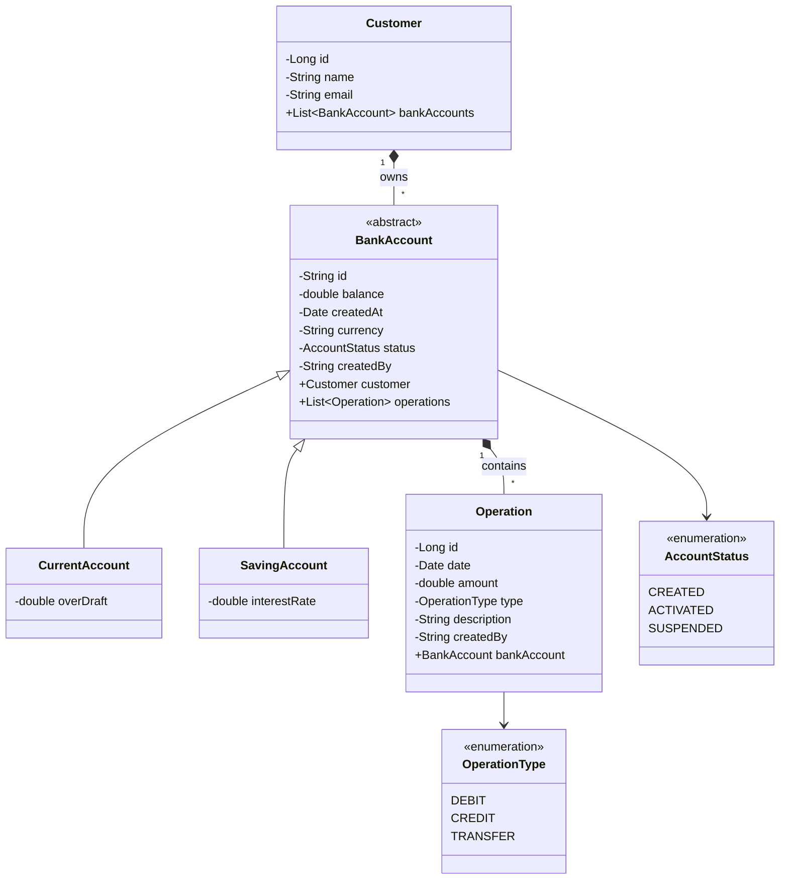

# 🏦 Digital Banking Application

<div align="center">

**Projet JEE : Spring Boot · Angular 18 · Spring Security JWT · AI Chatbot RAG + Telegram**<br>
*ENSET Mohammedia — Université Hassan II de Casablanca*<br>
*Module : Java EE & Frameworks Web*<br>
*Encadrant : Pr. Mohamed Youssfi*

**Réalisé par**<br>
FALAG Youssef | BDCC2

<br>


[](https://spring.io/)
[](https://angular.io/)
[](https://mistral.ai/)
[](https://www.postgresql.org/)

**An enterprise-grade financial management platform integrating generative AI, high-performance micro-services architecture, and real-time data visualization.**

[Explore Docs](http://localhost:8085/swagger-ui.html) • [Report Bug](https://github.com/yousseffalag/Digital-Banking-APP/issues) • [Request Feature](https://github.com/yousseffalag/Digital-Banking-APP/issues)

</div>

---

## 📖 Table of Contents
- [Project Overview](#-project-overview)
- [UML Modeling (Deliverables)](#-uml-modeling-deliverables)
- [Project Structure](#-project-structure)
- [Visual Showcase (Full Gallery)](#-visual-showcase-full-gallery)
- [Key Features](#-key-features)
- [Tech Stack](#-tech-stack)
- [Installation](#-installation)
- [Security](#-security)
- [Author](#-author)

---

## 🌟 Project Overview

This project is a comprehensive **Digital Banking Solution** designed to modernize financial operations. It bridges the gap between traditional banking management and AI-driven insights. Whether it's managing customer lifecycles, executing complex inter-account transfers, or querying an AI about financial trends, this platform provides a unified, secure, and highly responsive experience.

---

## 📐 UML Modeling (Deliverables)

This section provides the formal modeling of the system architecture and interactions, suitable for academic and enterprise deliverables.

### 1. Class Diagram



### 2. System Architecture (RAG & AI Chatbot)

```text
Deux canaux d'accès
┌──────────────┐          ┌──────────────┐
│ Interface    │          │   Telegram   │
│ Web Angular  │          │ @BankinAIBot │
│ HTTP Stream  │          │ Long Polling │
└──────┬───────┘          └──────┬───────┘
       └──────────┬──────────────┘
                  ▼
         ┌─────────────────┐
         │ Spring AI       │
         │ Chatbot (8087)  │
         └────────┬────────┘
                  │
      ┌───────────┴────────────┐
      ▼                        ▼
┌──────────────┐     ┌──────────────────┐
│ mistral-embed│     │ mistral-small    │
│ (embeddings) │     │ (génération LLM) │
└──────┬───────┘     └────────┬─────────┘
       ▼                      ▼
┌──────────────┐     ┌──────────────────┐
│ Vector Store │────►│ Réponse enrichie │
│ (docs indexés│     │ par le contexte  │
└──────────────┘     └──────────────────┘
```

#### 🔄 Pipeline RAG en 6 étapes
1. **Question utilisateur** (depuis le portail web ou Telegram).
2. **Embedding vectoriel** via `mistral-embed`.
3. **Recherche de similarité** (top-4 chunks) dans le Vector Store.
4. **Injection du contexte** pertinent dans le prompt système.
5. **Génération LLM** par Mistral AI (`mistral-small-latest`).
6. **Réponse** → Web (streaming SSE) · Telegram (message complet).

#### ⭐ Fonctionnalités de l'Assistant IA
| Fonctionnalité | Web Angular | Telegram |
|----------------|-------------|----------|
| Réponses en langage naturel | ✅ | ✅ |
| Streaming temps réel | ✅ | — |
| Rendu Markdown | ✅ | ✅ |
| Historique multi-tours | ✅ | ✅ |
| Réinitialisation contexte | ✅ | ✅ (`/clear`) |
| Multilingue FR/EN | ✅ | ✅ |
| Intégré dans la sidebar | ✅ | — |
| Commandes Slash directes | — | ✅ |

---

## 📁 Project Structure

```text
Digital-Banking-APP/
├── backend/                  # Spring Boot Core Application
│   ├── src/main/java/org/example/
│   │   ├── dtos/             # Data Transfer Objects
│   │   ├── entities/         # JPA Entities
│   │   ├── enums/            # Enumerations
│   │   ├── exceptions/       # Custom Exception Handling
│   │   ├── mappers/          # DTO to Entity Mappers
│   │   ├── repositories/     # Spring Data JPA Repositories
│   │   ├── security/         # JWT and Security Configurations
│   │   ├── services/         # Business Logic Layer
│   │   └── web/              # RESTful Controllers
│   ├── src/main/resources/   # App Properties & Static Assets
│   └── docker-compose.yml    # PostgreSQL & phpMyAdmin Configuration
│
├── Chat-bot/                 # Spring AI Chatbot Service (Mistral)
│   ├── src/main/java/net/youssef/chatbot/
│   │   ├── agents/           # AI Agents & Tools
│   │   ├── integration/      # Backend API Client
│   │   └── web/              # Chat Controller
│   └── .env                  # AI API Keys
│
└── frontend/                 # Angular 18 Client
    ├── src/app/
    │   ├── accounts/         # Account Management UI
    │   ├── chatbot/          # AI Chat Interface
    │   ├── customers/        # Customer Directory UI
    │   ├── dashboard/        # Analytics & ChartJS
    │   ├── guards/           # Route Protection
    │   ├── login/            # Authentication UI
    │   └── services/         # API HTTP Clients
    └── package.json          # Node Dependencies
```

---

## 📸 Visual Showcase (Full Gallery)

A comprehensive walkthrough of the application's user interface and integrations.

### 📊 Executive Analytics Dashboard
*Real-time financial statistics, user growth, and operational distribution powered by ChartJS.*
<br>


---

### 🤖 Intelligent AI Assistant
*Mistral AI integration allowing administrators to query database records using natural language.*
<br>


---

### 📱 Telegram Bot Integration
*Secure and interactive Telegram Bot interface for remote banking assistance.*
<br>


---

### 🔐 Secure Authentication Portal
*JWT-secured entry point with role-based access control (RBAC).*
<br>


---

### 👥 Customer Directory
*Paginated and searchable directory of all registered banking customers.*
<br>


---

### ➕ Add New Customer
*Form to register and onboard new banking customers.*
<br>


---

### 🏦 Account View & Creation
*Deep dive into a specific customer's associated bank accounts and statuses.*
<br>


---

### 🏧 Core Financial Operations
*Execute atomic Debit, Credit, and inter-account Transfers with real-time balance updates.*
<br>


---

### ⚙️ User Profile
*Administrator profile and session management.*
<br>


---

### 📖 Swagger API Documentation
*Interactive OpenAPI 3.0 specification for backend endpoints.*
<br>


---

### 🗄️ Database Management (phpMyAdmin)
*Containerized database administration interface.*
<br>


---

## 🚀 Key Features

### 🏦 Core Banking Engine
- **Multi-Account Support**: Manage both **Current** (with overdraft) and **Saving** (with interest rates) accounts.
- **Transaction Engine**: Atomic **Credit, Debit, and Transfer** operations with full rollback protection.
- **Audit Trails**: Every operation records the authenticated user who performed it for maximum accountability.

### 🤖 Intelligent AI Assistant (The Brain)
- **Mistral AI Integration**: A smart agent that understands your banking database.
- **Natural Language Querying**: Ask *"Who is our top customer?"* or *"What is the balance of account X?"*.
- **Direct Commands**: Quick access via `/accounts`, `/customers`, and `/history`.

### 📊 Advanced Analytics Dashboard
- **Financial Visuals**: Dynamic charts showing account distribution and operation trends using **ChartJS**.
- **Real-time Statistics**: Instant visibility into total balances, customer growth, and system health.

---

## 🛠 Tech Stack

### Frontend
- **Framework**: Angular 16 (Reactive Architecture)
- **Styling**: Bootstrap 5 + Vanilla CSS (Premium Customization)
- **Charts**: ng2-charts (ChartJS)
- **Icons**: Bootstrap Icons / Lucide

### Backend
- **Core**: Spring Boot 3.2 (Java 17)
- **Security**: Spring Security + JWT (Stateless)
- **AI**: Spring AI (Mistral Integration)
- **Database**: Spring Data JPA + PostgreSQL
- **Validation**: Lombok + Jakarta Validation

---

## ⚙️ Installation

### 1️⃣ Clone the Repository
```bash
git clone https://github.com/yousseffalag/Digital-Banking-APP.git
```

### 2️⃣ Database Configuration (Docker)
The project includes a `docker-compose.yml` to instantly spin up **PostgreSQL** and **phpMyAdmin** (or pgAdmin depending on your config).

```bash
# Start the database and administration tool in detached mode
docker compose up -d
```

Update `backend/src/main/resources/application.properties` to connect to PostgreSQL:
```properties
spring.datasource.url=jdbc:postgresql://localhost:5432/ebank
spring.datasource.username=YOUR_USER
spring.datasource.password=YOUR_PASS
```

### 3️⃣ Start the Ecosystem
| Component | Directory | Command |
|-----------|-----------|---------|
| **Backend** | `/backend` | `mvn spring-boot:run` |
| **AI Bot** | `/Chat-bot` | `mvn spring-boot:run` |
| **Frontend** | `/frontend` | `npm install && ng serve` |

---

## 🔐 Sécurité & Authentification (JWT)

Le système implémente une architecture de sécurité rigoureuse basée sur JSON Web Tokens (JWT) et un hachage fort (BCrypt) :

```text
POST /auth/login { username, password }
        ↓
Vérification via InMemoryUserDetailsManager
        ↓
Génération du JWT HS512 (validité 10 min)
        ↓
Angular stocke le token dans le localStorage
        ↓
Intercepteur HTTP Angular → Authorization: Bearer <token>
        ↓
NimbusJwtDecoder valide chaque requête entrante sur le backend
```

**Endpoints Accessibles :**
- Les endpoints de lecture (ex: `/accounts/**`, `/customers/**`) et `/chat` sont configurés pour être accessibles et permettre à l'agent IA de consulter les données librement.
- `/auth/login` et `/swagger-ui/**` sont publiquement accessibles.
- Toutes les opérations de modification (POST, PUT, DELETE) nécessitent une autorisation stricte `ADMIN`.

---

## 👤 Author

**Youssef Falag**
- 🌍 [GitHub Profile](https://github.com/yousseffalag)
- 💼 [LinkedIn](https://linkedin.com/in/youssef-falag)

---
<div align="center">
  <sub>Built with passion for the Future of Banking 🏦✨</sub>
</div>
